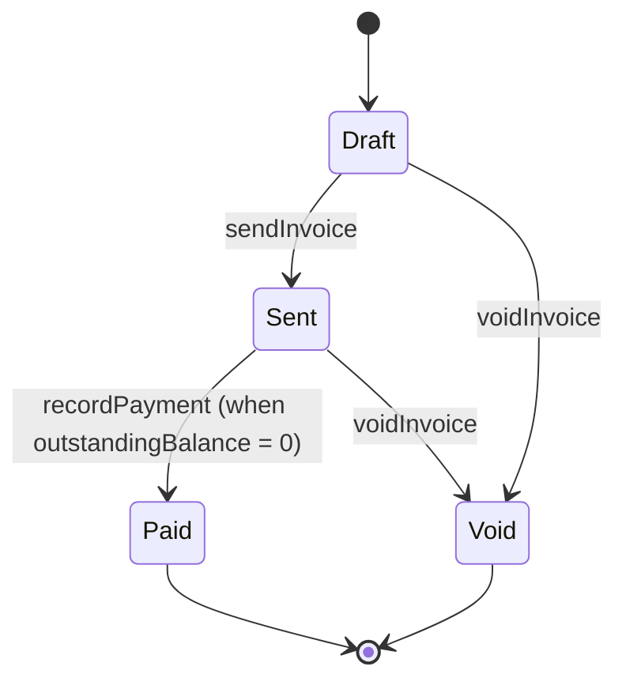

# Architecture

Detailed reference for tiny-voice internals. For the concise agent guide, see `CLAUDE.md`.

## State machine

### Allowed transitions by status

| Current status | Allowed operations | Disallowed (returns error) |
|---|---|---|
| **Draft** | `addLineItem`, `sendInvoice` (requires >= 1 line item), `voidInvoice` | `recordPayment` (InvalidTransition) |
| **Sent** | `recordPayment` (rejects overpayment), `voidInvoice`, `addLateFee` (one late fee only) | `addLineItem` (InvalidTransition), `sendInvoice` (InvalidTransition) |
| **Paid** | None | All operations return `AlreadyPaid` |
| **Void** | None | All operations return `InvoiceVoided` |

When `recordPayment` causes `outstandingBalance` to reach zero, the status automatically transitions from Sent to Paid.

## Port / Adapter table

| Port | Location | Real adapter | Test adapter |
|---|---|---|---|
| `Clock` | `src/shared/time/clock.ts` | `SystemClock` (`src/shared/time/system-clock.ts`) | `FixedClock` (`src/shared/time/fixed-clock.ts`) |
| `Database` | `src/shared/db/database.ts` | `SqliteDatabase` (`src/shared/db/sqlite-database.ts`) | In-memory SQLite via `setupDb` (`src/shared/testing/db-fixture.ts`); stub DB in unit tests |
| `Config` | `src/shared/config/config.ts` | `EnvConfig` (`src/shared/config/env-config.ts`) | `InMemoryConfig` (`src/shared/config/in-memory-config.ts`) |
| `Logger` | `src/shared/logger/logger.ts` | `ConsoleLogger` (`src/shared/logger/console-logger.ts`) | `CapturingLogger` (`src/shared/logger/capturing-logger.ts`) |
| `FeatureFlags` | `src/shared/flags/feature-flags.ts` | `ConfigFeatureFlags` (`src/shared/flags/config-feature-flags.ts`) | `InMemoryFeatureFlags` (`src/shared/flags/in-memory-feature-flags.ts`) |
| `EventBus` | `src/shared/events/event-bus.ts` | `InProcessEventBus` (`src/shared/events/in-process-event-bus.ts`) | Same `InProcessEventBus` (in-process, no external infra) |
| `ClientRepository` | `src/clients/ports/client-repository.ts` | `SqliteClientRepo` (`src/clients/adapters/sqlite-client-repo.ts`) | `InMemoryClientRepo` (`src/clients/adapters/in-memory-client-repo.ts`) |
| `InvoiceRepository` | `src/invoicing/ports/invoice-repository.ts` | `SqliteInvoiceRepo` (`src/invoicing/adapters/sqlite-invoice-repo.ts`) | `InMemoryInvoiceRepo` (`src/invoicing/adapters/in-memory-invoice-repo.ts`) |
| `RevenueReadModel` | `src/reporting/ports/revenue-read-model.ts` | `SqliteRevenueReadModel` (`src/reporting/adapters/sqlite-revenue-read-model.ts`) | `InMemoryRevenueReadModel` (`src/reporting/adapters/in-memory-revenue-read-model.ts`) |
| `PdfGenerator` | `src/invoicing/ports/pdf-generator.ts` | `PdfKitGenerator` (`src/invoicing/adapters/pdf-kit-generator.ts`) | `StubPdfGenerator` (`src/invoicing/adapters/stub-pdf-generator.ts`) |
| `NotificationSender` | `src/invoicing/ports/notification-sender.ts` | `ConsoleNotificationSender` (`src/invoicing/adapters/console-notification-sender.ts`) | `CapturingNotificationSender` (`src/invoicing/adapters/capturing-notification-sender.ts`) |

## Event / Subscriber fan-out table

All subscribers are registered in `src/app/register-subscribers.ts`.

| Event | Emitted by | Subscribers |
|---|---|---|
| `InvoiceSent` | `sendInvoice` command handler (`src/invoicing/commands/send-invoice.ts`) | 1. `NotificationSender.sendInvoiceSent` |
| `InvoicePaymentRecorded` | `recordPayment` command handler (`src/invoicing/commands/record-payment.ts`) | 1. `registerRevenueProjection` -> `RevenueReadModel.recordPayment` 2. `NotificationSender.sendPaymentReceived` |
| `InvoiceVoided` | `voidInvoice` command handler (`src/invoicing/commands/void-invoice.ts`) | _(no subscribers — void is a terminal state)_ |

**Event payload design rule:** Events carry IDs and immutable facts (amounts, timestamps) — never mutable state (names, balances, statuses). Subscribers that need mutable data fetch it fresh from the repository at handling time. This avoids stale snapshots embedded in event payloads.

Cache invalidation is handled directly in Server Actions (`src/app/lib/actions/index.ts`) via `updateTag` from `next/cache`, not through the event bus.

Note: The revenue projection is registered via `registerRevenueProjection` from the reporting module (`src/reporting/projections/register-revenue-projection.ts`), which subscribes to `InvoicePaymentRecorded` and calls `readModel.recordPayment`.

## Composition root tour

`buildApp()` in `src/app/build-app.ts` constructs the full dependency graph in this order:

1. **Config** -- `EnvConfig` reads validated env vars via Zod schema
2. **Infrastructure** -- `SystemClock`, `ConsoleLogger`, `ConfigFeatureFlags`
3. **Database** -- `SqliteDatabase` at the configured path; runs migrations from `migrations/`
4. **Repositories** -- `SqliteClientRepo`, `SqliteInvoiceRepo`, `SqliteRevenueReadModel`
5. **Adapters** -- `PdfKitGenerator` or `StubPdfGenerator` (selected by `PDF_GENERATOR` config), `ConsoleNotificationSender`
6. **Event bus** -- `InProcessEventBus<InvoicingEventMap>`
7. **Subscribers** -- `registerSubscribers()` wires revenue projection and notification handlers
8. **Queries** -- Closures over repos/read model, exposed as `AppDeps.queries.{clients,invoicing,reporting}`
9. **RPC context** -- `setRpcContext()` stores deps for the oRPC handler to access

Returns an `AppDeps` object (defined in `src/app/app-deps.ts`). Accepts `Partial<AppDeps>` overrides so tests can swap any piece.

`src/app/app.ts` calls `buildApp()` at module scope and exports `app` typed as `AppReadView` — a narrow interface exposing only `queries`, `featureFlags`, and `clock`. RSC pages import from here and can only read data through `app.queries.*`. Repos, event bus, DB, and other infrastructure are not on this type. Mutations go through Server Actions which use the RPC context (`get-rpc-context.ts`), a separate channel with full access to command dependencies. Client components must never import this file.

**Why the read surface is narrow:** Without this constraint, RSC pages drift toward calling repos directly, bypassing the query layer. This breaks data-level `'use cache'` (which works at the query boundary), couples pages to aggregate internals, and makes cache invalidation unpredictable. If a page needs data not currently on `app.queries`, the fix is a new query function — not widening `AppReadView`.

## How to add a new feature

Example: "Add a CSV export of monthly revenue."

1. **Create a query** in the appropriate module: `src/reporting/queries/export-revenue-csv.ts`. Export the handler function and a Zod input schema (co-located).
2. **Add to module index**: Re-export from `src/reporting/index.ts`.
3. **If it's a mutation**: Wire through `src/app/rpc/contract.ts` as a new procedure with `.actionable()` in `src/app/rpc/router.ts`.
4. **If it's a query**: Add to `AppDeps.queries` in `src/app/app-deps.ts` and `src/app/build-app.ts` (and `build-test-app.ts`). Call from an RSC with `'use cache'` + `cacheTag`. RSC pages access data only through `app.queries.*` — never import repos or call `findById` directly from a page component.
5. **If it needs a new port** (new IO boundary): Define the port interface in the module's `ports/` directory. Implement real + test adapters in `adapters/`. Wire in `buildApp`.
6. **If it emits events**: Define event type + Zod schema in the module's `events/` directory. Add to `InvoicingEventMap` (or create a new event map). Register subscribers in `src/app/register-subscribers.ts`.
7. **Write tests**: Property-based tests for domain invariants (fast-check), example tests for happy/sad paths, integration test via `buildIntegrationTestApp()` for SQL-backed flows.
8. **Verify**: `pnpm typecheck && pnpm lint && pnpm deps && pnpm test`
