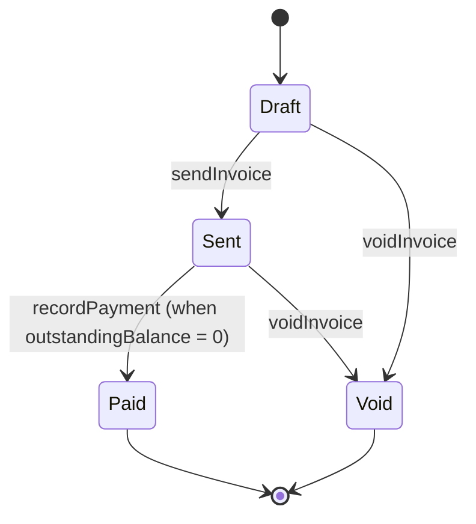

# Architecture

Detailed reference for tiny-voice internals. For the concise agent guide, see `CLAUDE.md`.

## State machine


```mermaid
stateDiagram-v2
  [*] --> Draft
  Draft --> Sent: sendInvoice
  Draft --> Void: voidInvoice
  Sent --> Paid: recordPayment (when outstandingBalance = 0)
  Sent --> Void: voidInvoice
  Paid --> [*]
  Void --> [*]
```

### Allowed transitions by status

| Current status | Allowed operations                                                                     | Disallowed (returns error)                                           |
| -------------- | -------------------------------------------------------------------------------------- | -------------------------------------------------------------------- |
| **Draft**      | `addLineItem`, `sendInvoice` (requires >= 1 line item), `voidInvoice`                  | `recordPayment` (InvalidTransition)                                  |
| **Sent**       | `recordPayment` (rejects overpayment), `voidInvoice`, `addLateFee` (one late fee only) | `addLineItem` (InvalidTransition), `sendInvoice` (InvalidTransition) |
| **Paid**       | None                                                                                   | All operations return `AlreadyPaid`                                  |
| **Void**       | None                                                                                   | All operations return `InvoiceVoided`                                |

When `recordPayment` causes `outstandingBalance` to reach zero, the status automatically transitions from Sent to Paid.

## Port / Adapter table

| Port                 | Location                                     | Real adapter                                                                          | Test adapter                                                                               |
| -------------------- | -------------------------------------------- | ------------------------------------------------------------------------------------- | ------------------------------------------------------------------------------------------ |
| `Clock`              | `src/shared/time/clock.ts`                   | `SystemClock` (`src/shared/time/system-clock.ts`)                                     | `FixedClock` (`src/shared/time/fixed-clock.ts`)                                            |
| `Database`           | `src/shared/db/database.ts`                  | `SqliteDatabase` (`src/shared/db/sqlite-database.ts`)                                 | In-memory SQLite via `setupDb` (`src/shared/testing/db-fixture.ts`); stub DB in unit tests |
| `Config`             | `src/shared/config/config.ts`                | `EnvConfig` (`src/shared/config/env-config.ts`)                                       | `InMemoryConfig` (`src/shared/config/in-memory-config.ts`)                                 |
| `Logger`             | `src/shared/logger/logger.ts`                | `ConsoleLogger` (`src/shared/logger/console-logger.ts`)                               | `CapturingLogger` (`src/shared/logger/capturing-logger.ts`)                                |
| `FeatureFlags`       | `src/shared/flags/feature-flags.ts`          | `ConfigFeatureFlags` (`src/shared/flags/config-feature-flags.ts`)                     | `InMemoryFeatureFlags` (`src/shared/flags/in-memory-feature-flags.ts`)                     |
| `EventBus`           | `src/shared/events/event-bus.ts`             | `InProcessEventBus` (`src/shared/events/in-process-event-bus.ts`)                     | Same `InProcessEventBus` (in-process, no external infra)                                   |
| `ClientRepository`   | `src/clients/ports/client-repository.ts`     | `SqliteClientRepo` (`src/clients/adapters/sqlite-client-repo.ts`)                     | `InMemoryClientRepo` (`src/clients/adapters/in-memory-client-repo.ts`)                     |
| `InvoiceRepository`  | `src/invoicing/ports/invoice-repository.ts`  | `SqliteInvoiceRepo` (`src/invoicing/adapters/sqlite-invoice-repo.ts`)                 | `InMemoryInvoiceRepo` (`src/invoicing/adapters/in-memory-invoice-repo.ts`)                 |
| `RevenueReadModel`   | `src/reporting/ports/revenue-read-model.ts`  | `SqliteRevenueReadModel` (`src/reporting/adapters/sqlite-revenue-read-model.ts`)      | `InMemoryRevenueReadModel` (`src/reporting/adapters/in-memory-revenue-read-model.ts`)      |
| `PdfGenerator`       | `src/invoicing/ports/pdf-generator.ts`       | `PdfKitGenerator` (`src/invoicing/adapters/pdf-kit-generator.ts`)                     | `StubPdfGenerator` (`src/invoicing/adapters/stub-pdf-generator.ts`)                        |
| `NotificationSender` | `src/invoicing/ports/notification-sender.ts` | `ConsoleNotificationSender` (`src/invoicing/adapters/console-notification-sender.ts`) | `CapturingNotificationSender` (`src/invoicing/adapters/capturing-notification-sender.ts`)  |

## Event / Subscriber fan-out table

All subscribers are registered in `src/app/register-subscribers.ts`.

| Event                    | Emitted by                                                                                            | Subscribers                                                                                                    |
| ------------------------ | ----------------------------------------------------------------------------------------------------- | -------------------------------------------------------------------------------------------------------------- |
| `InvoiceSent`            | `sendInvoice` transition (`src/invoicing/entities/invoice.ts`), dispatched by `applyInvoiceCommand`   | 1. `NotificationSender.sendInvoiceSent`                                                                        |
| `InvoicePaymentRecorded` | `recordPayment` transition (`src/invoicing/entities/invoice.ts`), dispatched by `applyInvoiceCommand` | 1. `registerRevenueProjection` -> `RevenueReadModel.recordPayment` 2. `NotificationSender.sendPaymentReceived` |
| `InvoiceVoided`          | `voidInvoice` transition (`src/invoicing/entities/invoice.ts`), dispatched by `applyInvoiceCommand`   | _(no subscribers — void is a terminal state)_                                                                  |

**Event payload design rule:** Events carry IDs and immutable facts (amounts, timestamps) — never mutable state (names, balances, statuses). Subscribers that need mutable data fetch it fresh from the repository at handling time. This avoids stale snapshots embedded in event payloads.

Cache invalidation is handled by TanStack Query: mutation server functions redirect or return on success; the calling component calls `queryClient.invalidateQueries()` in `onSuccess`. This is not routed through the event bus.

Note: The revenue projection is registered via `registerRevenueProjection` from the reporting module (`src/reporting/projections/register-revenue-projection.ts`), which subscribes to `InvoicePaymentRecorded` and calls `readModel.recordPayment`.

## Invoice command dispatch

Most invoice mutations follow the same shape:

1. Load the aggregate by ID
2. Apply a pure transition (from `src/invoicing/entities/invoice.ts`)
3. Save the result inside a transaction
4. Enqueue every event the transition emitted in the outbox
5. Drain the outbox after commit

Transitions on the `Invoice` aggregate return an `Outcome<Invoice, InvoiceDomainEvent>` — the new aggregate state paired with the domain events the transition emitted. The envelope type lives in `src/shared/outcome/outcome.ts`; the discriminated union of events lives in `src/invoicing/events/invoice-domain-event.ts`. Transitions that change state without publishing (e.g. `addLineItem`, `addLateFee`) return `events: []`.

`applyInvoiceCommand` (`src/invoicing/commands/apply-invoice-command.ts`) is the single interface that performs this dispatch. It accepts a closure of type `InvoiceTransition = (invoice: Invoice) => Result<InvoiceOutcome, InvoiceError>` and owns the rest: load, transaction, outbox enqueue per event, and post-commit drain.

Server functions in `src/app/fns/` parse input, construct any IDs/timestamps they need, and pass an inline transition closure to the dispatcher:

```ts
const result = await applyInvoiceCommand(
  { db: app.db, repo: app.invoiceRepo, outbox: app.outbox, eventBus: app.eventBus },
  { invoiceId: input.invoiceId },
  (invoice) => sendInvoice(invoice, app.clock.now()),
);
```

Transitions that need wall-clock data accept a `now: Date` (or `today: DueDate`) primitive — passing a value rather than the `Clock` port keeps the entity free of dependencies on infrastructure while still letting tests fix time.

`createInvoice` (insert) and `deleteInvoice` (hard delete) do **not** go through `applyInvoiceCommand` — they have different shapes (insert assembles a new aggregate; delete touches multiple tables with no transition). See [ADR-0001](adr/0001-invoice-command-dispatch-scope.md).

> **Save semantics**: `SqliteInvoiceRepo.save` rewrites the full line-item set
> (delete + re-insert) on every save and appends only new payments. The
> rewrite is intentional — the repository persists whole aggregates (see
> AGENTS.md rule 2) rather than diffing mutations. Do not "optimize" it into
> partial updates.

## Composition root tour

`buildApp()` in `src/app/build-app.ts` constructs the full dependency graph in this order:

1. **Config** -- `EnvConfig` reads validated env vars via Zod schema
2. **Infrastructure** -- `SystemClock`, `ConsoleLogger`, `ConfigFeatureFlags`
3. **Database** -- `SqliteDatabase` at the configured path; runs migrations from `migrations/`
4. **Repositories** -- `SqliteClientRepo`, `SqliteInvoiceRepo`, `SqliteRevenueReadModel`
5. **Adapters** -- `PdfKitGenerator` or `StubPdfGenerator` (selected by `PDF_GENERATOR` config), `ConsoleNotificationSender`
6. **Event bus** -- `InProcessEventBus<InvoicingEventMap>`
7. **Subscribers** -- `registerSubscribers()` wires revenue projection and notification handlers
8. **Queries** -- Closures over repos/read model, exposed as `AppDeps.queries.{clients,invoicing,reporting}`

Returns an `AppDeps` object (defined in `src/app/app-deps.ts`). Accepts `Partial<AppDeps>` overrides so tests can swap any piece.

`src/app/instance.ts` exports `getAppInstance` and `getAppReadView` — both wrapped with `createServerOnlyFn` so the client bundle receives a stub that throws if a client component imports them. `getAppReadView` returns `AppReadView`, a narrow interface exposing only `queries`, `featureFlags`, and `clock`. Query server functions in `src/app/fns/` call `getAppReadView()` and return data; mutation server functions call `getAppInstance()` and have full access. Client components use `useSuspenseQuery` with `queryOptions` to fetch, and `useMutation` + `queryClient.invalidateQueries` to mutate.

**Why the read surface is narrow:** Without this constraint, server functions drift toward calling repos directly, bypassing the query layer. This couples server functions to aggregate internals and makes cache invalidation unpredictable. If a route needs data not currently on `app.queries`, the fix is a new query function — not widening `AppReadView`.

## How to add a new feature

Example: "Add a CSV export of monthly revenue."

1. **Create a query** in the appropriate module: `src/reporting/queries/export-revenue-csv.ts`. Export the handler function and a Zod input schema (co-located).
2. **Import directly**: There are no barrel files (enforced by ESLint
   `barrel-files/avoid-barrel-files`). Consumers import from the source file:
   `import { exportRevenueCsv } from '@/reporting/queries/export-revenue-csv'`.
3. **If it's a mutation**: Create a server function in `src/app/fns/` using `createServerFn({ method: 'POST' })`. Define the input schema (Zod) in the fn module — that's the HTTP boundary. Call `getAppInstance()` to access the full `AppDeps`. Call `queryClient.invalidateQueries` in the component's `onSuccess`.
   - **For an invoice load → mutate → save mutation**: add a pure transition to `src/invoicing/entities/invoice.ts` returning `Result<InvoiceOutcome, InvoiceError>` — the new aggregate plus any `InvoiceDomainEvent`s the transition publishes. If the transition publishes a new event variant, add it to `InvoiceDomainEvent` and `InvoicingEventMap` (with the matching Zod schema in `src/invoicing/events/`). Then dispatch via `applyInvoiceCommand` from the fn, passing an inline closure. See [Invoice command dispatch](#invoice-command-dispatch).
   - **For an insert (like `createInvoice`) or hard delete (like `deleteInvoice`)**: skip the dispatcher and call the repo directly from a dedicated command function. ADR-0001 explains why.
4. **If it's a query**: Add to `AppDeps.queries` in `src/app/app-deps.ts` and wire it in `src/app/wire-queries.ts` (shared by both `build-app.ts` and `build-test-app.ts`). Expose it via a server function in `src/app/fns/`. Add `queryOptions` in `src/app/queries/`. Fetch in route components via `useSuspenseQuery`. Route files access data only through `app.queries.*` via server functions — never import repos or call `findById` directly from a route file.
5. **If it needs a new port** (new IO boundary): Define the port interface in the module's `ports/` directory. Implement real + test adapters in `adapters/`. Wire in `buildApp`.
6. **If it emits events**: Define event type + Zod schema in the module's `events/` directory. Add to `InvoicingEventMap` (or create a new event map). Register subscribers in `src/app/register-subscribers.ts`.
7. **Write tests**: Property-based tests for domain invariants (fast-check), example tests for happy/sad paths, integration test via `buildIntegrationTestApp()` for SQL-backed flows.
8. **Verify**: `pnpm typecheck && pnpm lint && pnpm deps && pnpm test`
